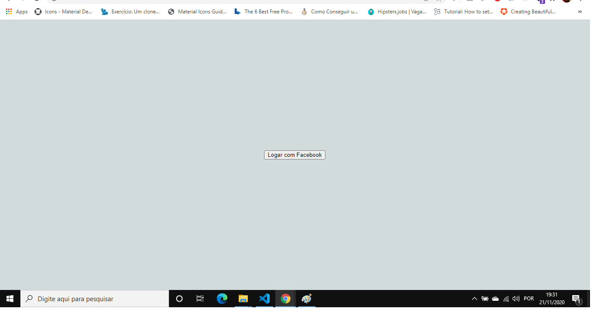
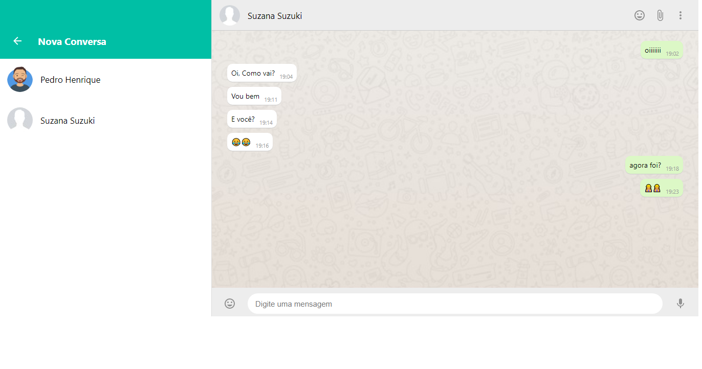
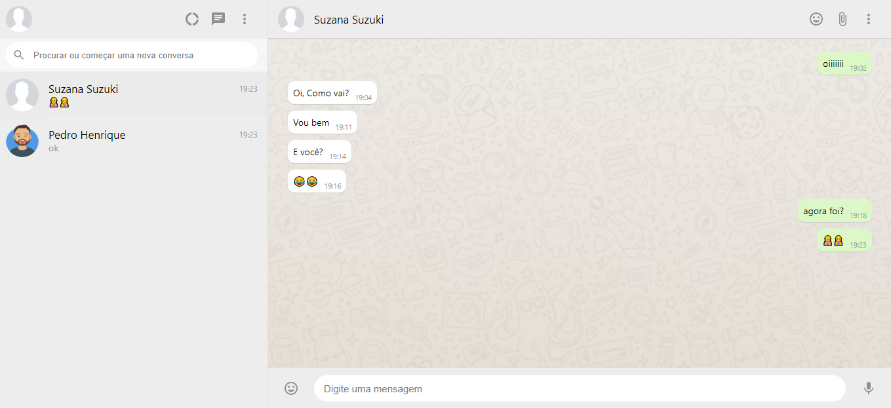

<h1>CloneWhatssApp for Study React and FireBase 💋📃</h1> 

Projeto desenvolvido em Live da Plataforma B7Web, utilizando o FireBase com React.

<h2>Funcionalidade Desenvolvidas no Projeto💬: </h2>

<ol>
    <li>Novas Conversas</li>
    <li>Login com Facebook</li>
    <li>Inclusão dos Emojis</li>
    <li>Mudança dos botões de Audio para Ente</li>
    <li>Historico de Conversas</li>
</ol>

<h2>🎯 Projeto Concluido🚀</h2>  

 

 

  

